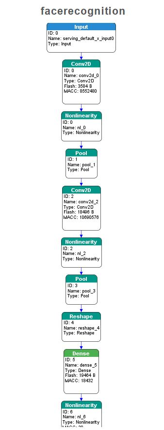

## Project title
**Self-driving-drug-delivery-robot**

## Motivation
The coronavirus, which started in early 2020 and has been prevalent around the world to this day, has made us living a difficult life. In that, we specifically thought of ways to help the medical staff.
Therefore, we noted that by using autonomous driving robots, it is possible to secure rest time for medical staff, improve physical strength, and provide non-face-to-face medical services by replacing tasks such as simple drug delivery.

## Tech
**STM32 (CubeAI)** 
Generate the model that can recognize faces and upload it on the stm32 board.

The layer consists of 2 convolution layer and a dense layer. For each convolution and dense layer, nonlinearity step.

**RaspberryPi**

## Hardware
**STM32 (CubeAI)** 
* Face detection
* Humidifier module

**RaspberryPi**
* Line detection 

